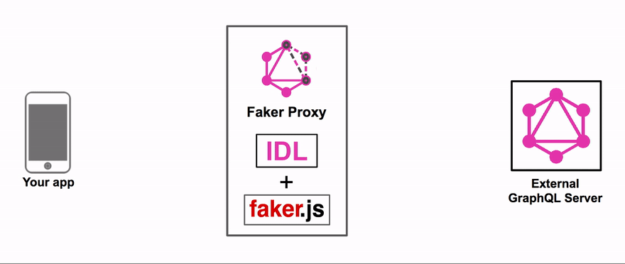

# GraphQL Faker Refactored

This project is technically a refactor of the [https://github.com/graphql-kit/graphql-faker](https://github.com/graphql-kit/graphql-faker) project - The dependancies have been updated and the project modernised. React has been updated, as well as the Code Editor (Code Mirror).

To see a running example of the project, setup to extend the `https://swapi-graphql.netlify.app` graphql endpoint go to the following URL:  
<a href="https://graphql-faker-editor-902888310147.us-central1.run.app" target="_blank" rel="noopener noreferrer">graphql-faker-editor-902888310147.us-central1.run.app</a>

*Note: It will take a few seconds to start up as it is setup to run on a GCP Cloud Run and requires a cold start...* 

The Back End Project can be found here:  
<a href="https://github.com/joepk90/graphql-faker-server" target="_blank" rel="noopener noreferrer">github.com/joepk90/graphql-faker-server</a>

The Front End Project can be found here:  
<a href="https://github.com/joepk90/graphql-faker-editor" target="_blank" rel="noopener noreferrer">github.com/joepk90/graphql-faker-editor</a>

To contribute to the project, see the development guide
<a href="https://github.com/joepk90/graphql-faker-refactored/blob/main/docs/development.md" target="_blank" rel="noopener noreferrer">here</a>.


## Reasoning for the Refactor
The main reason for making this project was to change the functionality of extending Types.

In the original project, it was not possible override existing fields on existing Types, only add new fields to existing Types.

Looking at the existing project, it seemed to me there was a great deal of duplicated and unneccesary logic, especially around the options object which get passed around everywhere. In order to understand where this issue was occuring, understanding the project was required, which led to a refactor; seperating the Editor from the Server, removing the `options` config object and `cli` logic and opting for using a `.env` file and `docker-compose`.

It is now possible to override fields on existing types and return data specified in the schema editor, meanwhile any existing fields on the type that have not been overridden will continue to return real data as normal. To see this in action the following Schema override and Query can be used.

For this example the public `https://swapi-graphql.netlify.app` endpoint is being used, which has an existing `Film` type and `allFilms` Query which returns a list of films. In the example below, we are overriding the `Film` type, and define the the values of the film titles ourselves:

<b>Schema extension to add to the Editor:</b>
```
extend type Film {
  title: String @examples(values: [
    "The Terminator",
    "Terminator 2: Judgement Day",
    "Terminaator 3: Rise of the Machines"
  ])
  rating: Int @examples(values: [5, 4, 1])
}
```

<b>Query to use in the GraphQL Playground:</b>
```
query ExampleQuery {
  allFilms {
    films {
      title
      rating
      director
    }
  }
}
```

<b>This should then return a list of of filmes with overridden title fields and a rating field which originally did not exist:</b>
```
"films": [
        {
          "title": "Terminaator 3: Rise of the Machines",
          "rating": 5,
          "director": "George Lucas"
        },
        {
          "title": "The Terminator",
          "rating": 4,
          "director": "Irvin Kershner"
        },
        {
          "title": "Terminaator 3: Rise of the Machines",
          "rating": 5,
          "director": "Richard Marquand"
        },
        {
          "title": "The Terminator",
          "rating": 5,
          "director": "George Lucas"
        },
        {
          "title": "Terminator 2: Judgement Day",
          "rating": 1,
          "director": "George Lucas"
        },
        {
          "title": "Terminaator 3: Rise of the Machines",
          "rating": 1,
          "director": "George Lucas"
        }
      ]
```

# Original Documentation (with modifications)

Mock your future API or extend the existing API with realistic data from [faker.js](https://fakerjs.dev/). **No coding required**.
All you need is to write [GraphQL SDL](https://alligator.io/graphql/graphql-sdl/). Don't worry, we will provide you with examples in our SDL editor.

In the GIF below we add fields to types inside real GitHub API and you can make queries from GraphiQL, Apollo, Relay, etc. and receive **real data mixed with mock data.**


## How does it work?

We use `@fake` directive to let you specify how to fake data. And if 60+ fakers is not enough for you, just use `@examples` directive to provide examples. Use `@listLength` directive to specify number of returned array items. Add a directive to any field or custom scalar definition:

    type Person {
      name: String @fake(type: firstName)
      gender: String @examples(values: ["male", "female"])
      pets: [Pet] @listLength(min: 1, max: 10)
    }

No need to remember or read any docs. Autocompletion is included!

## Features

- 60+ different types of faked data e.g. `streetAddress`, `firstName`, `lastName`, `imageUrl`, `lorem`, `semver`
- Comes with multiple locales supported
- Runs as a local server (can be called from browser, cURL, your app, etc.)
- Interactive editor with autocompletion for directives with GraphiQL embedded
- ✨ Support for proxying existing GraphQL API and extending it with faked data
  

## Setup

Clone and run the project using Docker Compose:
```
# clone the repository
git clone git@github.com:joepk90/graphql-faker-refactored.git

# move into the repository
cd graphql-faker-refactored

# move into the repository
cp .env.example .env

# start the service
make start
```

The configuration has now been moved to an `.env` file. This is true for this repository and the front end and back end projects too.


### Or run with Docker

Run the service with no customizations:
```
docker run -it \
	-p 8080:8080 \
	-e VITE_API_URL="/api" \
	jparkkennaby/graphql-faker-refactored
```

Or run the service with customizations (extending the swapi-graphql.netlify.app graphql and using custom headers)
```
docker run -it \
	-p 8080:8080 \
	-p 3000:3000 \
	-p 5173:5173 \
	-e SCHEMA_FILE_NAME=schema_extension \
	-e ALLOWED_HOSTS=http://localhost:5173 \
	-e SERVER_PORT=3000 \
	-e EXTEND_URL=https://swapi-graphql.netlify.app/graphql \
	-e VITE_API_URL=/api \
	-e CUSTOM_HEADERS=TRUE \
	-v $(PWD)/.headers:/app/.headers \
  jparkkennaby/graphql-faker-refactored
```

*Note: to use custom headers, a `.headers/.headers.json` file must be accessible in the directory where the `docker run` command was used*


### *Options*

| *Option*              | *Description*                                                                                     |
|---------------------|-------------------------------------------------------------------------------------------------|
| `EXTEND_URL`        | URL to an existing GraphQL server to extend.                                           |
| `FORWARD_HEADERS`   | Specify which headers should be forwarded to the proxied server                  |
| `SCHEMA_FILE_NAME`  | Name of the Schema file you want to edit. [default: `schema_extension`]           |
| `CUSTOM_HEADERS`    | Option to add custom headers to GraphQL requests (Currently required in order to use Voyager) [default: `FALSE`].   |
| `ALLOWED_HOSTS`     | Hosts allowed to access the server. Set this value to `*` to disable cors. [default: `http://localhost:5173,`  ].     |
| `SERVER_PORT`       | Set the server port. Primarily for use in PROD  [default: `3000`].  |
| `CLIENT_PORT`       | Set the clients port. Primarily for use in PROD [default: `5173`]       |
| `VITE_API_URL`      | URL of the Server [default: `http://localhost:3000`]                    |\


This option has been removed but could be re-added:
- `-H`, `--header`: Specify headers to the proxied server in cURL format, e.g., `Authorization: bearer XXXXXXXXX`.

## Contributors
Notes regarding [contributions](https://github.com/joepk90/graphql-faker-refactored/blob/main/docs/contributors.md).