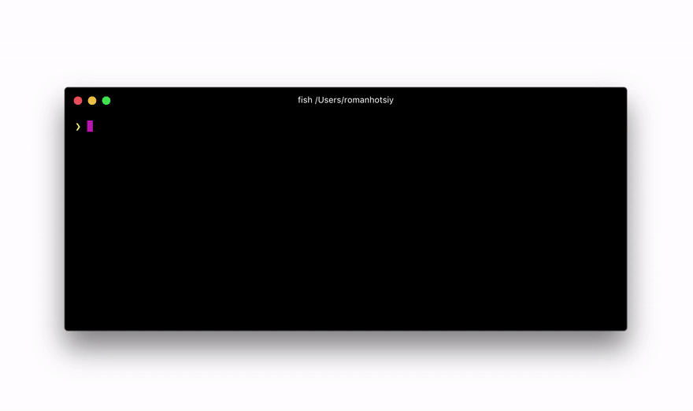

# GraphQL Faker Refactored

This project is technically a refactor of the [https://github.com/graphql-kit/graphql-faker](github.com/graphql-kit/graphql-faker) project - The dependancies have been updated and the project modernised.

The Back End Project can be found here:
[github.com/joepk90/graphql-faker](https://github.com/joepk90/graphql-faker) 

The Front End Project can be found here:
[https://github.com/joepk90/graphql-editor](github.com/joepk90/graphql-editor) 


## Reasoning
The main reason for making this project was to change the functionality of extending types. It is now possible to override existing types and return the data that you define. For example:

```
extend type PreExistingType 	{
  	PreExisting: Boolean @examples(values: [false])
}
```

# Original Documentation (Edited Slightly)

Mock your future API or extend the existing API with realistic data from [faker.js](https://fakerjs.dev/). **No coding required**.
All you need is to write [GraphQL SDL](https://alligator.io/graphql/graphql-sdl/). Don't worry, we will provide you with examples in our SDL editor.

In the GIF below we add fields to types inside real GitHub API and you can make queries from GraphiQL, Apollo, Relay, etc. and receive **real data mixed with mock data.**


## How does it work?

We use `@fake` directive to let you specify how to fake data. And if 60+ fakers is not enough for you, just use `@examples` directive to provide examples. Use `@listLength` directive to specify number of returned array items. Add a directive to any field or custom scalar definition:

    type Person {
      name: String @fake(type: firstName)
      gender: String @examples(values: ["male", "female"])
      pets: [Pet] @listLength(min: 1, max: 10)
    }

No need to remember or read any docs. Autocompletion is included!

## Features

- 60+ different types of faked data e.g. `streetAddress`, `firstName`, `lastName`, `imageUrl`, `lorem`, `semver`
- Comes with multiple locales supported
- Runs as a local server (can be called from browser, cURL, your app, etc.)
- Interactive editor with autocompletion for directives with GraphiQL embedded
- ✨ Support for proxying existing GraphQL API and extending it with faked data
  

## Install

    ```
    docker-compose up
    ```

Or pull down the independanct backend and frontend projects and run each with:
```
make dev
```

The configuration has now been moved to an `.env` file. THis is true for this repository, which just includes a `docker-compose.yaml` file, and the projects themselves


### Options

- `ALLOWED_HOSTS` hosts allowed to access the server (to manage cors locally)
- `PORT` HTTP Port [default: `env.PORT` or `9002`]
- `SCHEMA_FILE_NAME` Name of the Schema file you want to edit (TODO these should shared locally with the host computer)
- `EXTEND_URL` URL to existing GraphQL server to extend
- `OPEN_BROWSER` Open the server (TODO this feature should be changed to the front end editor instead)
- `CUSTOM_HEADERS` Specify which headers should be forwarded to the proxied server (TODO this should be changed to forward headers)
 
See `.env `file for other options

This option has been removed, but could be re-added
- `-H`, `--header` Specify headers to the proxied server in cURL format, e.g.: `Authorization: bearer XXXXXXXXX`